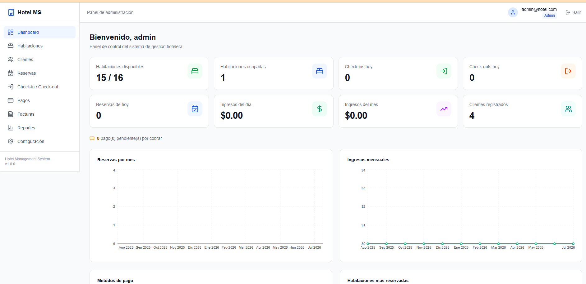
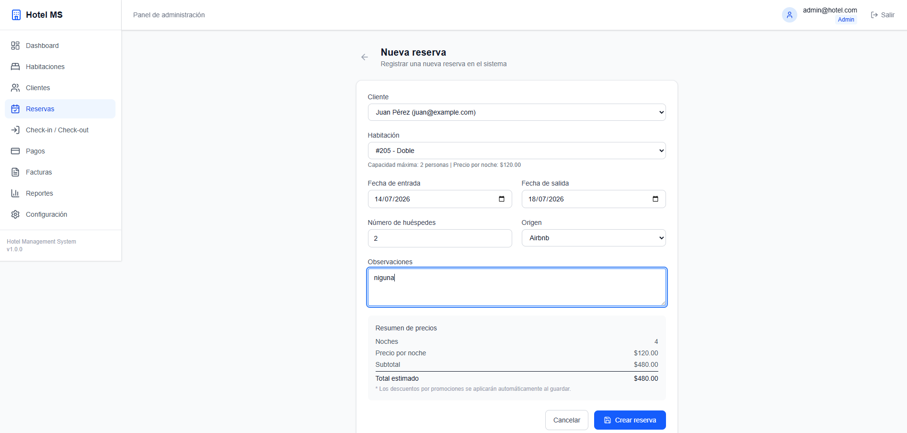
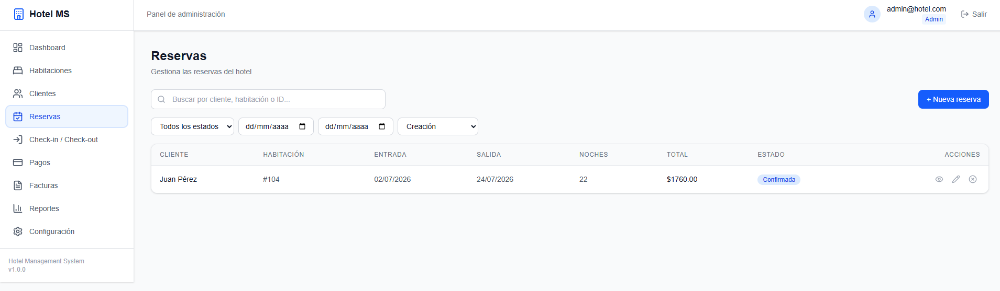
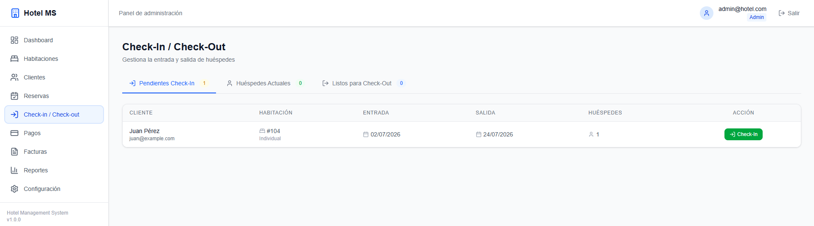
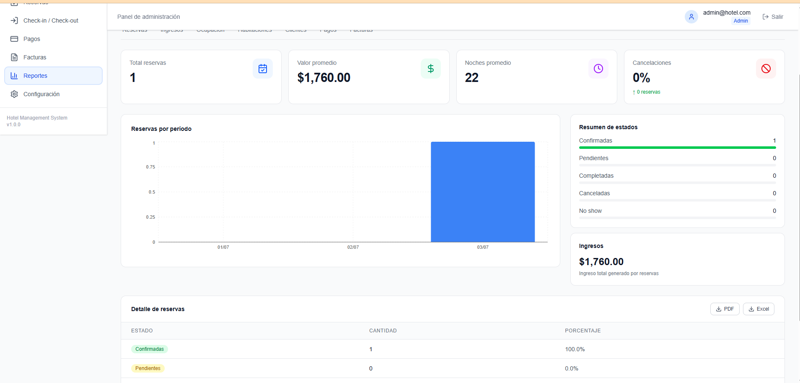

# 🏨 Hotel Management System

Sistema web completo para la administración de hoteles desarrollado con Next.js.

## Demo

https://TU-PROYECTO.vercel.app

---

# Tecnologías

- Next.js 15
- React 19
- TypeScript
- Prisma ORM
- PostgreSQL (Neon)
- Auth.js
- Tailwind CSS
- Zod
- Recharts

---

# Funcionalidades

- Login seguro
- Dashboard
- Gestión de habitaciones
- Gestión de clientes
- Reservas
- Check-In
- Check-Out
- Pagos
- Facturas
- Reportes
- Configuración

---

# Capturas

## Landing


## Login


## Dashboard



## Habitaciones


## Reservas



## Pagos



## Facturas



## Reportes



---

# Instalación

```bash
git clone https://github.com/TU-USUARIO/hotel-management-system.git

cd hotel-management-system

npm install
```

Crear archivo `.env`

```
DATABASE_URL=

AUTH_SECRET=

AUTH_URL=http://localhost:3000
```

Luego ejecutar

```bash
npx prisma migrate deploy

npm run seed

npm run dev
```

---

# Arquitectura

```
src/

features/

components/

lib/

prisma/

docs/
```

---

# Autor

Andrés Aguirre
